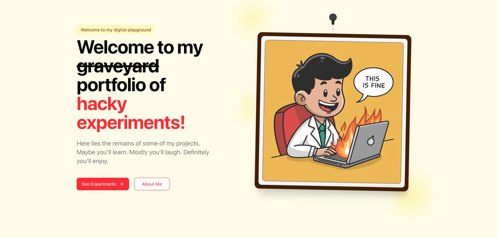

# Hacky Experiments

  

**An open source playground for my experiments**

## 👋 Welcome

Welcome to Hacky Experiments! This repository is home to my coding experiments, side projects, and technical explorations. Each project represents a unique journey into technology, problem-solving, and creative coding. I'm passionate about building, iterating quickly, and learning along the way.

## 🔍 What's Inside

Inside this repository you'll find:
- **Experiments**: A collection of coding experiments and side projects. These are external projects.
- **Blog**: Posts and insights on my technical explorations.
- **Microapps**: Small, focused applications designed for quick demos. They will be part of the codebase here.

Each project comes with its own setup instructions—simply navigate to the project directory and check out its README for installation and usage details.

## 🚀 Getting Started

1. Clone the repository.
2. Choose the project you're interested in.
3. Follow the instructions provided in the project's README file.

## 🛠️ Technologies

My experiments make use of various technologies, including but not limited to:

- **Next.js**
- **Tailwind CSS / Shadcn**
- **Bun** (for scripts)
- **Various APIs**
- And more!

## 📝 License

This repository is licensed under the MIT License. See the [LICENSE](LICENSE) file for details.

## 🤝 Contributing

These projects are personal experiments, but I welcome suggestions, bug reports, and pull requests. Feel free to open an issue to discuss any ideas or improvements.

## 📫 Contact

Have questions or want to reach out? You can:
- Open an issue in this repository
- Connect with me on [Twitter](@deepwhitman)

---

> "All life is an experiment. The more experiments you make, the better."  
> — Ralph Waldo Emerson

If you're curious about how I build stuff and continuously improve through rapid iteration, you're in the right place. Let's build, experiment, and embark on this adventure together!

---

Created with ☕ by [Bilal Tahir](https://github.com/btahir)
